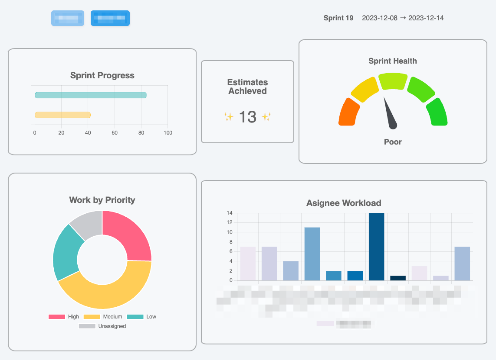

# Notion Sprint Dashboard

## Table of contents

- [Overview](#overview)
  - [About](#about)
  - [Screenshot](#screenshot)
  - [Links](#links)
  - [Built with](#built-with)
- [Author](#author)

## Overview

### About

This app was created for CEO and board members so they can visualize the sprint data being tracked in Notion. The data is captured via the Notion API and then visualized graphically with the ChartJS library, creating visualizations to provide sprealined view of engineering team's sprint progress and health.

### Screenshot

### Links

https://github.com/chleighton1/notion-sprints-frontend/assets/60336791/6ce5d5ce-5957-4ab9-8959-64161f28aac8

### Built with

- [React](https://reactjs.org/) - JS library
- [Express.js](https://expressjs.com/) - Backend
- [ChartJS](https://www.chartjs.org/) - For visualizations

## Author

- Website - [Charles Leighton](https://www.chleighton.live/)
